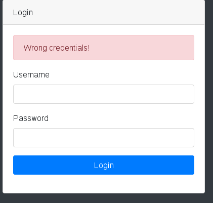
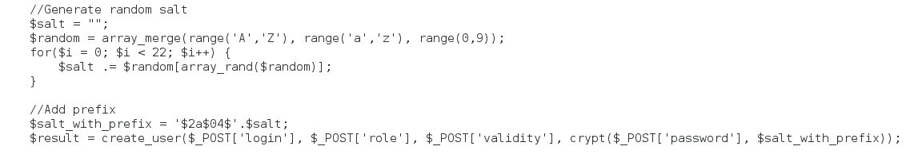

# STI Rapport étude de menaces #

## Introduction ##
Ce rapport présente la d
euxième partie du projet de Sécurité des Technologies Internet. Elle consiste en l'analyse et la sécurisaté de l'application web réalisée lors de la première partie du projet. Dans une premier temps, une analyse des menaces a été effectuée, afin de mettre en évidences les différentes menaces et les éléments à sécuriser. Ensuite, les différentes contre-mesures présentées ont été implémentées afin de sécuriser l'application. Le but final est que l'application garde les même fonctionnalités, mais présente moins de failles.
 
## Description du système ##

Dans cette première partie, l'ojectif est de rassembler toutes les informations sur le système qui pourraient être utile pour identifier les menaces. Elle consiste principalement à savoir quels sont le sobjectifs du système, quels sont ses exigences en matière de sécurité et de quoi il est constitué.

### Objectifs ###
Le système a pour objectif de permettre aux employés de communiqués entre eux en s’envoyant des messages. Cela contribue au bon fonctionnement de l’entreprise en permettant aux informations de circuler correctement. La qualité du système contribue à la réputation de l’entreprise du point de vue des employés. Plus le système est adéquat et solide, plus les employés comprennent que la société prend en compte leurs besoins.
Hypothèses de sécurité
Afin de garantir la sécurité, le système est uniquement utilisé par des employés de l’entreprise (aucune personne externe ne peut avoir un compte dessus). Les utilisateurs sont donc être créés par un administrateur. L’entreprise s’assure que les administrateurs sont des personnes de confiance.

### Exigences ###

**Informations des utilisateurs:** Tout d’abord, aucune action ne doit être possible sans être authentifié. Les fonctionnalités liées à la gestion des utilisateurs doivent être réservées aux administrateurs. Ils devraient être les seuls à pouvoir créer un nouvel utilisateur, modifier les informations d’un utilisateur ou supprimer un utilisateur. Ils devraient également être les seuls à pouvoir consulter les informations des utilisateurs. Les mots de passe des utilisateurs ne doivent pas être accessibles, même par un administrateur. 

**Messages:** Les messages reçus par les autres utilisateurs ne doivent pas pouvoir être consultés, modifiés ou supprimés. Un utilisateur ne doit pas pouvoir modifier ou supprimer (de la base de données) un message après l’avoir envoyé. Il ne doit pas être possible d’envoyer des messages en se faisant passer pour un autre employé.

Finalement, le système doit pouvoir garantir une disponibilité d’au moins 99%. S’il est acceptable d’avoir des interruptions pour maintenance car le système sera principalement utilisé pendant les heures de bureau, il est important qu’il garantisse une certaine disponibilité afin de ne pas impacter le fonctionnement de l’entreprise.

### Constituants ###

Les deux principaux éléments du système sont l’application et la base de données, qui contient les informations des utilisateurs et les messages. 

Les utilisateurs du système peuvent les deux rôles suivants :

* **Employé:** est autorisé à lire, écrire et supprimer des messages.
* **Administrateur:** en plus de ce que peut faire un employé, est autorisé à gérer les utilisateurs (ajout, modification, suppression).

Les utilisateurs peuvent également être inactifs, peu importe leur rôle, ce qui signifie qu’ils ne peuvent plus avoir accès aux fonctionnalités de l’application.

## Enumération des actifs ##

Cette partie est essentielle pour savoir ce qui devra être protégé.

On peut considérer principalement trois actifs : les messages, les données des utilisateurs et l’infrastructure elle-même.

### Messages ###
Les aspects à protéger sont :

* L’intégrité
* La confidentialité
* La disponibilité

Un incident pourrait résulter en :

* une perte de confiance en l’entreprise de la part des employés 
* un dysfonctionnement partiel de l’entreprise

### Données ###

Actuellement les seules données stockées sont les login/password, mais dans la réalité d’autres informations pourraient être ajoutés. 

Les aspects à protéger sont :

* La confidentialité
* L’intégrité 

Un incident pourrait résulter en :

* Une perte de confiance en l’entreprise de la part des employés
* Une perte d’argent pour l’entreprise (amende pour ne pas avoir protégé les données)

### Infrastructure ###

L’aspect à protéger est :

* La disponibilité

Un incident pourrait résulter en :

* Un grand dysfonctionnement de l’entreprise

## Data Flow Diagram ##

## Périmètre de sécurisation ##

Afin de pouvoir sélectionner les éléments à sécuriser, nous avons établi une liste de priorités des différentes menaces. Les menaces se trouvant en haut de la liste sont celles que l'ont veut éviter à tout prix, et c'est donc ce séléments qui devront être sécurisés en premier:

1.	**Accès à la zone admin :** Cela permettrait d’ajouter/de modifier ou de supprimer des utilisateurs , c equi est un gros problème. Le login doit donc être sécurisé au maximum. Il est aussi important de rechercher les failles qui permettraient d'y accéder autrement que par le login.
2.	**Accès au message des autres utilisateurs :** Pour garantir la confidentialité, il faut être sûr d'avoir identitifé toutes les failles qui pourraient permettre d'y accéder.
3. **Message forgés :** S'il est possible de modifier l'expéditeur d'un message, cela pose un gros problème de confiance. 
4.	**Modification/suppression des messages après envoi :** Egalement problématique, car cela peut nuire à la bonne communication dans l'entreprise.
5.	**Récupération des mots de passe:** Comme cela nécessiterait d'abord de voler les hash, puis de retrouver les mots de passe correspondant, cette menace peut être évaluée plus tard.
 
## Sources de menaces ##

Dans cette partie, les différents types de personnes qui pourraient potentiellement tenter de porter atteinte au système sont énumérées. Leurs motivation, leur cible et la potentialité qu'il attaque réellement le système sont également présentés.

### Employés / utilisateurs malins ###

**Motivation :** vengeance, espionnage industriel, curiosité

**Cible :** messages des autres utilisateurs

**Potentialité :** haute

### Concurrent ###

**Motivation :** espionnage industriel

**Cible :** Les messages présents dans la base de données (secrets industriels)

**Potentialité :** Moyenne

### Hackers, script-kiddies ###

**Motivation :** défi, ego, s’amuser

**Cible :** Tout le système

**Potentialité :** Moyenne

### Cybercrime ###

**Motivation :** financières

**Cible :** Informations des utilisateurs, spam/phishing

**Potentialité :** Moyenne

## Scénarios d'attaques ##

Cette partie du rapport présente tout d'abord la méthode catégorisation STRIDE qui sera utilisée, puis les différents scénarios d'attaque qui ont été imaginés. Chacun de ces scénarios contient des informations permettant de lui attribuer une priorité, ou simplement de le catégoriser comme l'impact que l'attaque aurait, les sources de menace, leurs motivations, les éléments attqués et les failles permettant l'attaque. Les scénarios sont ensuite décrits en détail avec, pour certains, une petite démonstration de l'attaque. Les contre-mesures sont ensiute nommées. Elles seront décrites plus en détail dnas le chapitre suivant.

### STRIDE ###

La méthode de catégorisation STRIDE permet d'identitier le but des attaquants pour une menace donnée. STRIDE signifie: 

* Spoofing
* Tampering
* Repudiation
* Information Disclosure
* Denial of Service
* Elevation of Privilege

Cela permet également de savoir comment contrer les menaces, chaque catégorie ayant un type de contrôle de sécurité associé:

* Spoofing -> Authentication
* Tampering -> Integrity
* Repudiation -> Non-Repudiation
* Information Disclosure -> Confidentiality
* Denial of Service -> Availabiliy
* Elevation of Privilege -> Authorization

De manière générale, cela permet de catégoriser les menaces afin d'avoir une meilleure vue d'ensemble.

### Scénario 1 : Guessing de mot de passe ###

Etant donné qu’il est nécessaire d’être authentifié pour avoir accès aux fonctionnalités de l’application, ce scénario est une première étape permettant ensuite de pouvoir lancer d’autres attaques. Les scénarios 2 et 3 présentent d’autres manières de s’authentifier illégalement.

**Catégorie STRIDE:** S (Spoofing)

**Impact:** Haut (permet d’effectuer d’autres attaques)

**Source de menace:** Hacker, Cybercrime, Concurrents, Employés

**Motivations:** 

* Pour les hackers, cela peut être un défi en soi ou un moyen d'accéder à plus de défis.
* Pour des cybercriminels ou des concurrents, l'intérêt est d'avoir accès au système de messagerie.
* Pour les employés, le but peut être de se faire passer pour quelqu'un d'autre, de lire les messages de quelqu'un d'autre ou d'utiliser des fonctionnalités réservées aux administrateurs.

**Element(s) du système attaqué:** Informations des utilisateurs (login/password)

**Faille(s) permettant l'attaque:**
* Aucune vérification sur les mots de passe choisis 
* Mots de passe définis par l’admin

**Scénario d'attaque:**

Lorsqu’on crée un utilisateur ou que l’on change son mot de passe, il n’est pas demandé de fournir un nombre minimum de caractères ou d’utiliser des chiffres et des signes de ponctuation. Il n’y a pas non plus d’avertissement rappelant à l’utilisateur de ne pas choisir un mot de passe trop simple. Il est donc fort possible qu’un grand nombre d’utilisateur choisissent comme mot de passe leur login ou quelque chose comme 1234. Dans la situation actuelle, tester les mots de passe suivants permet d’accéder à tous les comptes :
-	Login (p. ex : admin ou lucie)
-	1234
-	12345678
-	Abcd
Une autre faiblesse actuelle est que seuls les administrateurs peuvent créer des nouveaux utilisateurs. L’avantage est que cela empêche des personnes externes de se créer un compte, mais l’inconvénient est que les administrateurs doivent mettre un mot de passe par défaut, que les utilisateurs sont censés modifier par la suite. Dans la réalité, le mot de passe par défaut sera souvent quelque chose de simple, pour simplifier la tâche à l’administrateur. Il peut s’agir par exemple du login, du nom de famille, ou d’une combinaison du prénom et du nom de famille. En ajoutant à ça le fait que plusieurs utilisateurs ne changeront pas très rapidement, voire jamais, tenter différentes combinaisons basées sur le nom des employés peut donner beaucoup de résultats. Les employés de l’entreprise sont ceux qui peuvent le mieux exploiter cette faiblesse, étant donné qu’ils connaissent la logique de choix des mots de passe.

**Contre-mesures:**

* Forcer les utilisateurs à choisir un mot de passe fort (au moins 8 caractères, lettres et chiffres, maj/min)
* Ajouter une recommendation (« Le mot de passe ne doit pas contenir votre login, votre nom ou prénom, le nom de l’entreprise ou de l’application. Si possible, choisissez un mot de passe qui n’a pas de sens. »)
* Pour les administrateurs : Générer un mot de passe aléatoire pour les nouveaux utilisateurs et le leur communiquer de manière sécurisée.

### Scénario 2 : Bruteforce de mot de passe ###

Cette attaque permet, comme la précédente, d'accéder aux fonctionnalités de l'application, mais elle demande plsu de compétences.

**Catégorie:** S (Spoofing)

**Impact:** Haut (permet d'effectuer d'autres attaques) 

**Source de menace:** Hackers, Concurrents, Cybercrime. Les employés peuvent également être une source de menace s'ils ont plus de compétences qu'un utilisateur standard.

**Motivations:** 
* Pour les hackers, cela peut être un défi en soi ou un moyen d'accéder à plus de défis.
* Pour des cybercriminels ou des concurrents, l'intérêt est d'avoir accès au système de messagerie.
* Pour les employés, le but peut être de se faire passer pour quelqu'un d'autre, de lire les messages de quelqu'un d'autre ou d'utiliser des fonctionnalités réservées aux administrateurs.

**Element(s) du système attaqué:** Informations des utilisateurs (login/password)

**Faille(s) permettant l'attaque:** 

* Une tentative de login prend très peu de temps, il est donc possible d'en faire beaucoup très rapidement.
* Le nombre de tentatives n'est pas limité.
* Le login est fait en une seule étape, très simple à automatiser.

**Scénario d'attaque:**

Une personne malveillante peut utiliser un outil pour tenter de se connecter en testant un grand nombre de combinaisons de caractères avec un outil approprié. Le fait que le nombre de tentatives ne soit pas limité et que le processus de login est très simple permet de faire cette attaque facilement. 

Ici, la puissance de cette attaque est renforcée par les failles présentées dans le scénario précédent. Plus les mots de passe sont longs, plus le bruteforce prendra de temps.

**Contre-mesures:**

* Limiter le nombre de tentatives par adresse IP

### Scénario 3: Vol de mot de passe (interception) ###

Comme dans les scénarios précédents, cette attaque permet de se connecter à l'application.

**Catégorie:** S (Spoofing)

**Impact:** Haut (permet d'autres attaques)

**Source de menace:** Employés capables d'utiliser Wireshark ou autres personnes ayant accès au reéseau interne de l'entreprise.

**Motivations:**

* Pour les employés, le but peut être de se faire passer pour quelqu'un d'autre, de lire les messages de quelqu'un d'autre ou d'utiliser des fonctionnalités réservées aux administrateurs.
* Pour des cybercriminels ou des concurrents, l'intérêt est d'avoir accès au système de messagerie.

**Element(s) du système attaqué:** Informations des utilisateurs (login/password)

**Faille(s) permettant l'attaque:**

* La page de login utilise http pour envoyer les requêtes qui contiennent les login/mot de passe de l'utilisateur.

**Scénario d'attaque:**

Les informations de login transitent en clair sur le réseau. Lorsqu'un utilisateur se connecte à son compte, une autre personne sur le même réseau peut sniffer le trafic et trouver le mot de pase de cet utilisateur en clair. L'outil *Wrieshark* peut être utilisé dans ce but. 

**Contre-mesures:**

* Utiliser SSL/TLS pour sécuriser la page de login.

### Scénario 4 : Vol de session ###

Cette attaque permet d'utiliser la session d'un autre utilisateur mais contient plus d'étapes que les scénarios précédents. Elle nécessite notamment d'être déjà connecté à l'application.

**Catégorie:** S (Spoofing), E (Elevation of privilege)

**Impact:** Haut (permet d'autres attaques)

**Source de menace:** Hackers, Concurrents, Employés avec suffisamment de compétences

**Motivations:**

* Pour les hackers, cela constitue un deuxième défi après s'être connecté au site, qui le permet de devenir admin.
* Pour les concurrents, cela permet de voler la session d'un administrateur et de lire ses messages, mais ce n'est pas très discret.
* Pour les employés, cela peut leur permettre d'accéder à des fonctionnalités réservées aux administrateurs (en prennant beaucoup de risques). Cela peut aussi leur permettre de se faire passer pour quelqu'un d'autre et de lire leurs messages.

**Element(s) du système attaqué:** Utilisateurs, messages des utilisateurs, et potentiellement les informations des utilisateurs.

**Faille(s) permettant l'attaque:**

* Cross-site scripting (XSS) possible dans la fonction d'écriture de messages.
* Cookies de session PHP utilisées avec la configuration de base.

**Scénario d'attaque:**

Il s'agit ici d'exploiter la faille XSS en envoyant un message à un autre utilisateur et en y introduisant le code qui nous permettra de voler sa session. Du code javascript peut simplement être placé dans le sujet ou le corps d'un message:

On voit que la faille XSS est présente car lorsque le destinataire ouvre le message, il obtient le résultat suivant:

Il s'agit ensuite d'utiliser cette faille pour récupérer le cookie de l'administrateur. Avec Javascript, un cookie peut être affiché d'une manière très simple: 

Comme on le voit, lorsque l'utilisateur ouvre ce message, son cookie est affiché:

Finalement, l'attaquant n'a qu'à envoyer ce cookie sur une page qu'il contrôle afin de l'afficher. Cela peut être fait avec une ligne de javascript:

Comme on le voit, lorsque l'administrateur ouvre le message, il effectuera automatiquement la requête suivante:

L'attaquant aura donc reçu la requête contenant le cookie de l'administrateur. Il n'aura donc ensuite plus qu'à remplacer la valeur de son propre cookie par celle du cookie de l'administrateur et il aura accès à sa session. Evidemment, un bon attaquant, fera en sorte que l'administrateur ne se rende pas compte que cette requête a été envoyée, mais nous ne rentrerons pas dans ces détails ici. 

Le fait que le cookie de l'administrateur puisse être utilisé aussi facilement une fois récupérer vient du fait que les cookies de session PHP sont ici utilisés avec leur configuration de base. Ils ne sont donc jamais modifiés avant la fin de la session et il est possible de fournir un identifiant de session sans qu'il ait été initialisé.

**Contre-mesures:**

* Contrôler le contenu des champs "Sujet" et "Message", pour empêcher l'injection de code. 
* Refuser les id de session qui n'ont pas été initialisés avant (strict mode, seulement disponible à partir de PHP 5.5.2).
* Régénerer l'id de session régulièrement (par exemple, lorsqu'un utilisateur se connecte).

### Scénario 5 : Mapping de l'application ###

Cette attaque ne permet aucune action directe, mais elle permet d'avoir accès à des informations qui devraient être cachées.

**Catégorie:** I (Information disclosure)

**Impact:** bas

**Source de menace:** Hackers, Concurrents, Cybercrime

**Motivations:**

* Pour tous, c'est un moyen de savoir quels fichiers existent sur le site, pour prévoir une autre attaque. Ce scénario est surtout intéressant pour les personnes externes à l'entreprise, ne connaissant pas le contenu du site.

**Element(s) du système attaqué:**

* Architecture de l'application

**Faille(s) permettant l'attaque:**

* Répertoires accessibles

**Scénario d'attaque:**

Il suffit d'entrer la bonne URL pour accéder directement à la liste de fichiers contenus dans les différents répertoires. Cela fonctionne avec les URL suivants: 

* localhost/includes
* localhost/models
* localhost/utils
* localhost/views

Lorsque l'on entre une de ces URL, ont obtient le résultat suivant: 

Les autres dossiers, contenant des fichiers définissant l'aspect du site (css, js, vendor) sont également accessibles.

L'attaquant peut ensuite utiliser ces éléments pour se représenter l'architecture du site, et voir quels éléments il aimerait attaquer.

**Contre-mesures:**

* Ajouter un fichier index.php à la racine des dossiers qui ne doivent pas être accessibles, contenant une redirection vers une autre page.

### Scénario 6 : Hameçonnage ###

Ce scénario nécessite d'être déjà connecté à l'application.

**Catégorie:** S (Spoofing), I (Information Disclosure)

**Impact:** moyen (dépend du niveau d'information des employés)

**Source de menace:** Cybercriminels

**Motivations:** 

* Leurs motivations sont principalement financières, le but est d'obtenir des informations qu'ils pourront revendre ou utiliser pour obtenir de l'argent.

**Element(s) du système attaqué:** Les utilisateurs, leur informations de connexion ou autre (en fonction de l'objectif de l'attaquant)

**Faille(s) permettant l'attaque:**

* Cross-site scripting (XSS) lors de l'écriture des messages
* Bêtise des utilisateurs

**Scénario d'attaque:**

En utilisant la faille XSS comme cela a été décrit dans le scénario 4, un attaquant peut ajouter du code dans un message dans le but d'afficher à celui qui l'ouvrira une fenêtre lui demandant d'entrer certaines informations (informations de connexion, numéro de carte de crédit ou autre). Plus la fenêtre affichée est crédible, plus l'utilisateur sera susceptible d'y croire et de donner des informations personnelles. 

**Contre-mesures:**

* Contrôler le contenu des champs "Sujet" et "Message", pour empêcher l'injection de code. 
* Informer les employés pour le permettre de reconnaître ce genre d'attaques.

### Scénario 7 : Suppression de messages envoyés ###

Ce scénario nécessite d'être déjà connecté à l'application.

**Catégorie:** R (Repudiation) / T (Tampering) / E (Elevation of privilege)

**Impact:** bas si utilisé de façon isolée, moyen si utilisé de manière intensive (voir scénario 9)

**Source de menace:** Employés avec suffisamment de compétences

**Motivations:**

* Faire en sorte que le destinataire ne voie pas le message qu'on lui a envoyé (pour des raisons diverses).

**Element(s) du système attaqué:** La base de données, plus précisément les messages stockés dedans.

**Faille(s) permettant l'attaque:**

* Cross-site scripting (XSS) lors de l'écriture de messages.

**Scénario d'attaque:**

Imaginons que deux employés utilisent le site de messagerie de l'entreprise pour discuter d'une affaire illégale. Accidentellement, l'un des deux envoie un message concernant cette affaire à leur patron. Il doit donc trouver un moyen de le supprimer avant que son patron ne découvre leur afffaire et les vire.

 
L'employé en question peut supprimer ce message en envoyant un second message au patron qui contient du code. Le code en question sera executé du côté du patron et utilisera le fait que seul le destinataire d'un message est autorisé à le supprimer. Ce code utilise donc les privilèges du patron pour supprimer le premier message. 
Le message que l'employé enverra à son patron pourrait être le suivant: 

*Note*: On part ici du principe que l'utilisateur a un moyen de connaître l'id des messages qu'il envoie. Comme l'id des messages est simplement incrémenté, il peut s'envoyer un message à lui-même et en déduire l'id du prochain message.

Lorsque le patron l'ouvre, il sera redirigé vers la page de suppresion de message, puis de nouveau vers sa messagerie, où le premier e-mail aura disparu:

Evidememnt, ce n'est pas très discret, et le patron pourrait décider d'ouvrir d'abord le premier message. L'employé peut donc décider de mettre son code dans le sujet du message, qui sera directement affiché:

Cette fois le patron sera directement redirigé vers la page de suppression de messages en se connectant. Par contre, comme il sera par la suite redirigé vers sa messagerie, l'employé doit également supprimer le message contant le code pour éviter une boucle infinie de redirection. Le message suivant devrait faire l'affaire:

 

Lorsque le patron ouvre sa messagerie, voici ce qu'il obtient:

Les deux messages suspects ont disparu.

**Contre-mesures:**

* Contrôler le contenu des champs "Sujet" et "Message", pour empêcher l'injection de code. 

### Scénario 8 : Ralentissement de l'application ###

Ce scénario nécessite d'être déjà connecté à l'application. 

**Catégorie:** D (Denial of Service)

**Impact:** moyen 

**Source de menace:** Employé avec des compétences suffisantes, Hackers, Concurrent

**Motivations:**

* Pour les employés, le but peut être d'embêter un autre employé.
* Pour un hacker, il peut d'agir d'un défi.
* Pour les concurrents, cela peut être un moyen de perturber la communication dans l'entreprise.

**Element(s) du système attaqué:** Disponibilité de l'application (pour un utilisateur)

**Faille(s) permettant l'attaque:**

* Cross-site scripting (XSS) sur la page d'écriture de message. 

**Scénario d'attaque:**

Nous avons vu dans le scénario précédent comment il était possible de faire une boucle infinie de redirection. Il suffit donc de réutiliser le même principe, par exemple en écrivant le message suivant: 

Lorsque le destinataire se connectera, il sera coincé dans une boucle de redirection l'empêchant d'utiliser la messagerie: 

**Contre-mesures:**

* Contrôler le contenu des champs "Sujet" et "Message", pour empêcher l'injection de code. 

### Scénario 9 : Suppression des utilisateurs ###

Ce scénario est basé sur le scénario 7. Il reprend les mêmes principes pour une utilisation plus large.

**Catégorie:** T (Tampering)/E (Elevation of Privilege)/D (Denial of Service)

**Impact:** haut (surtout s'il n'y a pas de backup)

**Source de menace:** Hackers, Employés mécontents avec les compétences nécessaires, Concurrents

**Motivations:**

* Pour un hacker, le but peut être de s'amuser. 
* Pour un employé mécontent (ou un ex-employé) et pour les concurrents, le but peut être d'empêcher le bon fonctionnement de l'entreprise en rendant le système de messagerie inutilisable.

**Element(s) du système attaqué:** La base de données et indirectment la disponibilité de l'application (sans utilisateur, elle n'est pas très utile).

**Faille(s) permettant l'attaque:**

- Cross-site scripting sur la page d'écriture de message.

**Scénario d'attaque:**

De la même manière qu'un message envoyé à un autre utilisateur peut être utilisé pour supprimer les messages de cet utilisateur, il est possible d'utiliser un message pour avoir accès à des fonctionnalités réservées à un administrateur. La seule qui ne nécessite pas d'étape intermédiaire est celle de suppression d'un utilisateur. 

Dans ce scénario, on imagine donc que quelqu'un veut supprimer tous les utilisateurs de la base de données. Pour cela, il faut que l'administrateur soit redirigé à son insu vers la page qui supprime un utilisateur, et cela jusqu'à ce qu'il n'y ait plus d'utilisateurs. Le code du message envoyé doit donc contenir une boucle et également supprimer le message suspect (le message a ici été écrit dans le corps du message pour qu'on puisse le voir en entier, mais il serait beaucoup plus discret de le mettre dans le sujet su message): 

Lorsque l'administrateur ouvre ce message, voici le résultat:

Etant donné que l'attaque n'est pas censée être discrète, il n'est pas nécessaire de rediriger l'administrateur vers la page sur laquelle il était à la base. Si on retourne sur la page des messages, le résultat suivant apparaît: 

Plus aucun message! En réalité, ils n'ont pas été supprimés, ils ne sont juste plus affichés, parce que les utilisateurs qui les ont envoyés n'existent plus. Par contre, le message qui a causé la suppresion des utilisateurs a bel et bien été supprimé, et quand la situation aura été rétablie, il ne pourra pas être retrouvé.

**Contre-mesures:**

* Contrôler le contenu des champs "Sujet" et "Message", pour empêcher l'injection de code. 

### Scénario 10: Récupération des mots de passe à partir des hash ###

Ce scénario part du principe que l'attaquant a pu obtenir les hash des mots de passe sotckés dans la base de données par un moyen qui nous est inconnu.

**Catégorie:** I (Information disclosure)

**Impact:** haut

**Source de menace:** Cybercrime, Hacker

**Motivations:**

* Pour les hackers, le but est seulement de s'amuser.
* Pour les cybercriminels, le but peut être de revendre les mots de passe trouvés (les utilisateurs utilisent souvent le même mot de passe pour plusieurs sites) ou de les utiliser directement sur certains sites dans le but de gagner de l'argent.

**Element(s) du système attaqué:** Base de données, Employés et Administrateurs

**Faille(s) permettant l'attaque:**

* Algorithme de hachage avec paramètres par défaut

**Scénario d'attaque:**

Si une manière d'accéder à la base de données nous a échappé et qu'un attanquant est capable de récupérer les hash des mots de passe, la seule chose qui peut l'empêcher d'obtenir les mots de passe est un algorithme de hachage suffisamment sûr. Dans le cas de notre application, nous avons simplement utilisé la fonction crypt(), avec les paramètres par défaut.

La documentation de php sur la fonction crypt() nous indique que cette fonction est faible lorsqu'elle est utilisée avec comme seul paramètre la valeur à hacher. L'algorithme de hachage est MD5, qui est connu pour ne plus être sûr et le salt utilisé dépend de l'implémentation. 

Ces faiblesses étant connues depuis longtemps, il est probable que des techniques pour récupérer les mots de passe à partir des hash existent déjà (par exemple si la valeur du salt utilisé est connue, des rainbow tables ont pu être calculées).

**Contre-mesures:**

* Utiliser un algorithme de hachage plus sûr (Blowfish)
* Générer un sel (*salt*) random lors de la création d'un nouvel utilisateur et le stocker avec l'utilisateur dans la base de données

## Contre-mesures ##

Cette dernière partie reprend les contre-mesures qui ont été citées pour les différents scénarios d'attaque. Elle présente leur implémentation en détail. 

### Mots de passe forts ###

**Scénario d'attaque 1**

La force des mots de passe doit être testée sur la page de création d'utilisateur, ainsi que sur la page de changement de mot de passe.
Pour que le mot de passe soit considéré comme fort, il doit avoir au moins 8 caractères, dont au moins une lettre minuscule, une lettre majuscule et un chiffre. La manière la plus rapide vérifier tous ces critères est d'utiliser un regex (source: https://openclassrooms.com/courses/protegez-vous-efficacement-contre-les-failles-web/controlez-les-mots-de-passe). Le code suivant a donc été ajouté dans views/create_user.php:

Il a également été ajouté sur la page de changement de mot de passe, views/profile.php:

Comme on peut le voir, lorsqu'un mot de passe ne correspond pas à tous les critères, un message d'erreur est affiché, rappelant les critères et ajoutant une recommendation: 

### Limiter le nombre de tentatives de login ###

**Scénario d'attaque 2**

https://openclassrooms.com/courses/protegez-vous-efficacement-contre-les-failles-web/l-attaque-par-force-brute
Pour pouvoir vérifier le nombre de tentatives par adresse IP par jour, il faut pouvoir stocker ces informations et donc ajouter une table "connexion" dans la base de données: 

Ensuite, il faut une fonction permettant d'ajouter des connexions et de vérifier le nombre de connexions ayant eu lieu depuis une certaine adresse IP ce jour-là: 

Cette fonction compte le nombre d'occurences de l'adresse IP puis ajoute une connexion si le nombre d'occurences est inférieur à 10. Si le nombre d'occurences est supérieure à 10, cette adresse IP a dépassé le nombre maximum de tentatives en 24h. 

La page de login doit ensuite afficher "Wrong credentials" si l'adresse IP a encore droit à des tentatives et un message informant l'utilisateur que le nombre de tentatives maximum est atteint sinon:

On peut vérifier que tout cela fonctionne en entrant un mauvais login/mot de passe plusieurs fois. En dessous de 10 tentatives, on obtient le résultat suivant:

Et en dessus de 10 tentatives, le résultat suivant: 

Il faut maintenant mettre quelque chose en place pour que les connexions soient supprimées chaque jour de la base de données. Pour cela, on va commencer par créer le script qui supprimera les connexions: 

Il est important que ce fichier ne soit pas dans l'arborescence du site, sinon n'importe qui peut l'utiliser pour effecer les connexions. Pour la suite des opérations, ce fichier doit être placé sur /home/sti. 

Ensuite, il faut automatiser le lancement de ce script. Cela peut être fait en utilisant *cron*, qui permet de lancer une commande, par exemple, tous les jours:

Cette commande ouvre l'éditeur Vi, qu'on utilise pour ajouter la ligne suivante: 

Cela signifie que tous les jours, à minuit, le script créé précédemment sera appelé et les connexions seront remises à zéro. 

### Utiliser SSL/TLS ###

**Scénario d'attaque 3**

Afin de s'assurer que totues les connections au site web sont sécurisé en SSL/TLS il suffit de rediriger les requêtes en HTTP vers la même page en HTTPS. Pour ce faire, il suffit de rajouter les lignes suivantes dans le fichier `/etc/httpd/conf/httpd.conf` dans la balise `<Directory "/var/www/html">`

		RewriteEngine On
		RewriteCond %{HTTPS} off
		RewriteRule (.*) https://%{HTTP_HOST}%{REQUEST_URI}

Ceci est possible car le serveur contient déjà un certificat autosigné et apache est configuré pour l'utiliser. Pour un maximum de sécurité, un certificat signé par une authorité reconnue peut être mis à la place de ceux déjà en place dans le dossier `/etc/pki/tls/`. La clef privée se trouve sour `private/localhost.key` et le certificat sous `certs/localhost.crt`. 

On peut voir que si on fait une requête sur `http://localhost/` on est redirigé vers la version sécurisé sur laquelle le navigateur refait la même requête et la page sécurisé est affiché comme le montre le cadenas dans la barre d'URL.   

### Contrôles pour empêcher XSS ###

**Scénarios d'attaque 4, 6, 7, 8 et 10**

Nous avons décidé de valider les messages avant de les enregistrer dans la base de donnée afin de pouvoir les afficher sans effort supplémentaire. Ceci a été fait à l'aide de la fonction `htmlspecialchars` au début de la fonction d'écriture dans la base de donnée.

Les balises et charactères spéciaux sont échappés et affiché correctement.

### Renforcer les identifiants de session ###

**scénario d'attaque 4**

Un premier élément serait d'activer le *strict mode*, empêchant les utilisateurs de modifier leur identifiant de session. Malheureusement cette otpion n'est disponible qu'à partir de PHP 5.5.2.

L'autre élément à mettre en place est de faire en sort que l'identifiant de session soit régénéré lorsque l'utilisateur se connecte ou se déconnecte. Ainsi, un identifiant de session récupéré par un attaquant ne sera pas valable longtemps. Il ne s'agit que d'une seule ligne à ajouter dans le fichier vies/login.php:

la même ligne doit être ajoutée dans le fichier utils/logout.php:

Une fois ces lignes ajoutées, on peut voir que l'identifiant de session est modifié quand l'utilisateur se connecte: 

Le comportement est le même lorsque l'utilisateur se déconnecte.

### Empêcher l'accès aux répertoires ###

**Scénario d'attaque 5**

Cette contre-mesure est extrêmement simple. Il suffit d'ajouter à la racine des différents répertoires un fichier index.php qui redirige vers une autre page: 

 https://openclassrooms.com/courses/protegez-vous-efficacement-contre-les-failles-web/protegez-vos-repertoires

### Renforcer l'algorithme de hachage des mots de passe ###

**Scénario d'attaque 10**

L'algorithme utilisé par défaut est MD5, avec un salt dépendant de l'implémentation. On reconnait MD5 au préfixe $1$:

L'algorithme de hachage recommandé est Blowfish, avec un hash différent pour chaque mot de passe. La partie du code contenant l'appel à la fonction crypt(9 lors de la création d'un nouvel utilisateur doit donc être modifiée:

Comme on le voit, actuellement il n'y a qu'un seul paramètre. pour utiliser blowfish, il faut une deuxième paramètre (salt) avec le format suivant: $2a$un nombre entre 04 et 31$sel de 22 caractères. Cela peut être fait au moyen du code suivant: 

http://www.the-art-of-web.com/php/blowfish-crypt/

Il n'est pas nécessaire de modifier la vérification de mot de passe. La fonction crypt() parse le hash pour retrouver l'algorithme utilisé et le salt. On voit que quand on crée un nouvel utilisateur, son hash est différent:

On peut confirmer que tout fonctionne en se connectant avec cet utilisateur. Le modification de l'appel la fonction crypt() doit également être fait sur la page de changement de mot de passe: 

Une fois cette modification faite, les utilisateurs qui modifient leur mot de passe auront un hash plus fort: 

Le script de création de base de données doit également être mis à jour:

## Conclusion ##

Au terme de ce projet, nous avons été en mesure de sécuriser une grande partie de l'application en appliquant des contre-mesures en fonction des menaces relevées plus tôt. La structure de l'analyse de menaces a été d'une grande aide pour organiser le travail. 

Ce travail nous a également permis de voir quels réflexes nous avons en matière de sécurité. En effet, l'application réalisée dans le cadre de la première partie du projet ne devait pas être particulièrement sécurisée, mais elle prévenait déjà de certaines attaques. Cela permet donc aussi de mettre en évidences les réflexes que nous n'avons pas encore, et de nous habituer à écrire du code sécurisé dès le départ.